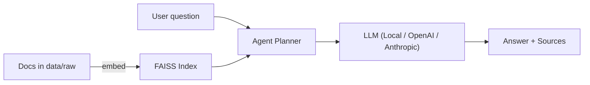

# agentic_ai

[]() []() []()


Retrieval-Augmented Generation with agent workflows

**Why this repo?** To showcase Agentic AI engineering skills:
- Clean, modular code (type hints, tests, docs)
- A real RAG pipeline (embeddings → vector database (FAISS) → retrieval)
- An *agentic* orchestration layer (tools + planner + tracer)
- CLI and FastAPI app with endpoints for indexing and querying
- GitHub Actions CI (lint + tests)

## Quickstart

```bash
# 1) Create env
python -m venv .venv && source .venv/bin/activate  # Windows: .venv\Scripts\activate

# 2) Install
pip install -U pip
pip install -e .

# 3) Index sample docs
agentic-ai index --folder data/raw

# 4) Ask a question
agentic-ai ask "What is agentic RAG?"

# 5) Run API
uvicorn agentic_ai.app:app --reload
```

## Project structure
```
agentic_ai/
├─ src/agentic_ai/
│  ├─ __init__.py
│  ├─ config.py
│  ├─ embeddings.py
│  ├─ vectorstore.py
│  ├─ retriever.py
│  ├─ llm.py
│  ├─ agent.py
│  ├─ cli.py
│  ├─ app.py
│  └─ finetune_lora.py
├─ data/raw/                  # put your PDFs/MD/TXT here
├─ tests/
│  ├─ test_index_and_query.py
├─ .github/workflows/ci.yml
├─ pyproject.toml
├─ README.md
└─ LICENSE
```

## Config
- Embeddings: `sentence-transformers/all-mpnet-base-v2` (can be changed in `config.py`)
- Vector DB: FAISS (local, persisted to `./data/index.faiss`)
- Default chat model for generation: **TinyLlama/TinyLlama-1.1B-Chat-v1.0** (CPU-friendly demo). Swap in your provider (OpenAI, Anthropic, etc.) via `llm.py`.

## API
- `POST /index` → build/update index from a folder
- `POST /ask` → { question: str, k: int } → agentic RAG answer + sources

## Notes
- Strong separation of concerns across modules
- Type hints & docstrings throughout
- Unit tests for RAG happy path
- CI runs lint + tests
- Clear README + CLI UX
- Easily swappable components (embeddings, LLM, store)

---

MIT © you


## Providers
Set `BACKEND` in `.env`:

```env
# local | openai | anthropic
BACKEND=openai
OPENAI_API_KEY=...
OPENAI_MODEL=gpt-4o-mini
# or
BACKEND=anthropic
ANTHROPIC_API_KEY=...
ANTHROPIC_MODEL=claude-3-5-sonnet-20240620
```

## Architecture



## Local-only usage (no API keys)
This repo defaults to a **local backend** (TinyLlama + sentence-transformers). It will auto-download models from Hugging Face the first time you run it—no API key required for these models.

```bash
# Index your own docs
agentic-ai index data/raw

# Ask
agentic-ai ask "What is agentic RAG?"
```

## Get a ready-made dataset (no keys)
Use the built-in downloader to fetch public datasets and convert them into text docs:
```bash
# HotpotQA contexts
agentic-ai download --dataset hotpot_qa --split train --limit 1000

# Or SQuAD v2 contexts
agentic-ai download --dataset squad_v2 --split train --limit 1000

# Then build the index from what was downloaded
agentic-ai index --folder data/raw
```


## Streamlit demo (local)
```bash
pip install -e .
streamlit run streamlit_app.py
```

## Simple evaluation
```bash
# Make sure you've indexed (and optionally downloaded) some data first
agentic-ai eval --dataset hotpot_qa --split validation --limit 50 --k 5
```

## Linter 
```bash
autoflake -r -i --remove-all-unused-imports --remove-unused-variables src && isort . && black . && flake8
```

📝 To-Dos / Roadmap

🔍 Retrieval / Indexing
- Smarter chunking: split text by semantic units (sentences, headings) instead of just whole docs.
- Reranker: add a cross-encoder reranker (e.g., sentence-transformers/ms-marco-MiniLM-L-6-v2) to re-rank the top 20 → top k.
- File support: extend ingestion to .docx, .html, .csv, maybe images via OCR.
- Index metadata: store titles, timestamps, tags; allow filtering (agentic-ai ask --filter tag=finance).
- Incremental indexing: update only changed files instead of rebuilding from scratch.

🧠 Agent / LLM
- Refusal guardrails: enforce “if no relevant source, say ‘not found’”.
- Answer style toggle: concise vs detailed vs bullet points.
- Multi-hop reasoning: let agent chain multiple retrievals if first answer is uncertain.
- Provider abstraction: allow switching local / OpenAI / Anthropic / Ollama at runtime from the UI.
- Response caching: store previous answers + sources to avoid recomputation.

🎛️ Streamlit UI
- Top-k slider (already suggested) in the UI.
- History panel: keep past questions + answers in a sidebar.
- Download results: button to export answers + sources as Markdown or JSON.
- File upload: drag-and-drop documents directly into data/raw and reindex.
- Theming: add light/dark mode toggle, recruiter-friendly branding.
- Side-by-side comparison: same question answered by different backends (local vs OpenAI vs Anthropic).

📊 Evaluation / Monitoring
- Metrics dashboard: show nonempty_rate, grounded_like_rate, cited_style_rate as charts in Streamlit.
- A/B testing: compare two prompts or two embedding models.
- Latency tracking: measure average response time per backend.
- Groundedness highlighting: highlight in the answer which words map to sources.

⚙️ DevOps / Infra
- Docker Compose: add a streamlit service alongside the API.
- Non-root user in Dockerfile for better security.
- CI: add pip-audit and bandit security scans.
- GitHub Pages: host docs (README + architecture diagram).
- Pre-commit hooks: lint/format/test before commits.

📂 Project polish
- README GIF demo: record Streamlit Q&A session.
- Architecture diagram (Mermaid already there; can expand with Reranker, Eval, UI).
- Badges: code coverage, security scan, Docker image size.
- Examples: a few “good” questions with real answers + citations.